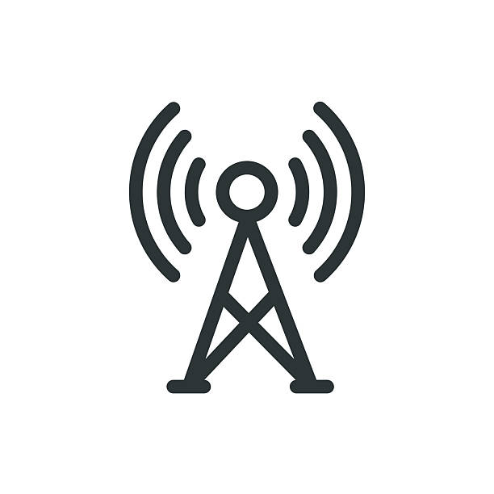

<figure markdown>
  { height="300" }
</figure>

# 航电系统

文档AI等级：4

航电系统是火箭的信息获取、状态判断、数据记录、无线通信以及任务控制核心。

本板块用于集中记录各代航电系统的硬件设计、软件架构、接口定义、调试过程、已知问题以及相关工程文件，使不同版本之间的设计演进能够被长期保存和追溯。

由于航电系统会随着 PCB、传感器、通信模块、电源设计和软件架构的迭代产生明显差异，因此本板块主要按照**航电系统版本**进行划分。每一个主要版本均拥有独立的文档目录。

---

## 航电系统包含的内容

航电系统文档主要涵盖以下内容：

* 飞行计算机与主控制器
* 惯性测量单元（IMU）
* 卫星导航系统（GNSS）
* 无线遥测与指令通信
* 数据记录与外部存储
* 电源与电压监测
* 飞行状态判断
* 回收系统控制接口
* 板载固件及软件架构
* 电气接口与机械安装接口
* PCB 设计与制造文件
* 调试、测试与故障记录

具体内容以各版本自身的文档为准。

---

## 版本管理方式

航电系统采用版本化方式进行文档管理。

当 PCB 结构、主要器件、系统架构或关键接口发生较大变化时，应建立新的航电版本目录，而不是直接覆盖旧版本文档。

例如：

```text
avionics/
├── v1/
├── v2/
└── v3/
```

旧版本即使已经停止使用，也原则上不应删除，因为其设计方案、测试数据和已知问题仍然具有参考价值。

小范围的软件修复、参数调整或文档修订通常不单独建立新的航电大版本，而应记录在对应版本内部。

---

## 航电版本

| 版本 | 状态   | 简介          | 文档                      |
| -- | ---- | ----------- | ----------------------- |
| V1 | 古早历史版本 | 2024年暑假搞的版本，未试飞成功, 且资料留存有限| [进入 V1 文档](v1/index.md) |
| V2 | 当前版本 | 当前主要开发与测试版本 | [进入 V2 文档](v2/index.md) |

> 上表中的版本状态应随着项目进展持续更新。

---

## 每个版本应记录的内容

每个航电版本原则上应至少记录以下信息：

### 硬件

* PCB 版本
* 原理图
* PCB 布局
* 主控制器
* 传感器
* 通信模块
* 存储器
* 电源系统
* 接插件与引脚定义
* BOM
* 制造文件

### 软件

* 固件版本，git记录
* 软件总体架构
* 驱动层设计
* RTOS 任务结构
* 数据记录系统
* 通信系统
* 指令系统
* 飞行状态机
* 参数与配置

### 接口

* 电气接口
* 通信接口
* 软件接口
* 机械安装接口
* 与其他火箭子系统之间的接口

### 测试与问题

* 上电测试
* 传感器测试
* 通信测试
* 存储测试
* 电源测试
* 整机联调
* 已知故障
* 已解决问题
* 尚未解决的问题

---

## 版本文档的作用

版本文档不应仅记录“这一版用了什么器件”，还应尽可能记录版本之间发生变化的原因。

例如：

* 为什么更换某个传感器
* 为什么修改 PCB 布局
* 为什么调整电源架构
* 为什么改变通信方式
* 为什么某个旧方案最终被废弃
* 某项修改解决了什么问题
* 新设计引入了哪些新的限制

这些信息能够使后续开发者理解设计演进过程，而不仅仅看到最终结果。

---

## 阅读建议

如果你第一次接触本项目的航电系统，建议：

1. 首先阅读当前使用版本的 `index.md`
2. 了解当前硬件组成和系统架构
3. 根据需要进入硬件、固件或接口文档
4. 遇到问题时查看当前版本的已知问题和测试记录
5. 如需了解某项设计的来源，可对照上一代版本进行比较

对于已经停止使用的旧版本，仍建议保留完整文档，以便进行故障追溯、设计比较和历史经验复用。

---

## 文档维护原则

航电版本发生重大变化时，应创建新的版本目录，并保留旧版本资料。

禁止通过直接修改旧版本文档的方式，使旧文档看起来像当前版本。

任何版本文档都应尽可能明确：

* 它描述的是哪一代硬件
* 对应哪个 PCB 版本
* 对应哪些固件版本
* 当前是否仍在使用
* 是否存在已知问题
* 哪个版本是当前推荐版本

这样可以避免不同代航电板之间的资料相互混淆。
