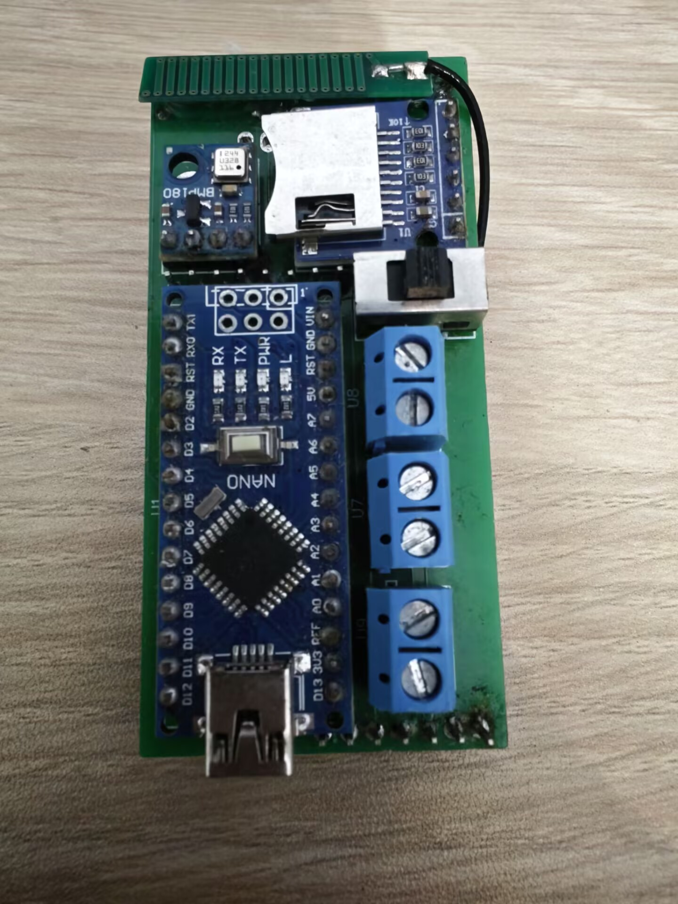
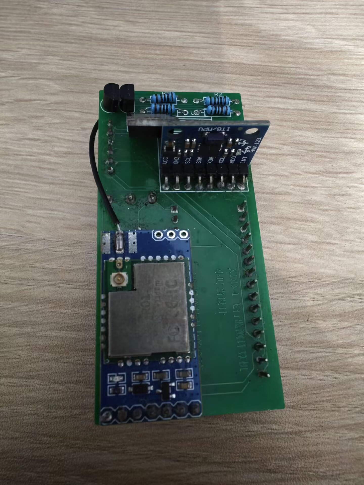

# V1版本航电

文档AI等级：0

<figure markdown>
  { width="200" }
  { width="200" }
</figure>

## 基本介绍

本航电于2024年6月份开始设计并研发，7月份PCB打样，配备了以模块为单位的主控模块和各种传感器模块，但由于经验不足知识不足等原因，存在着结构性和设计的重大问题，在第一次试飞中断连并失踪。

## 硬件信息

- arduino nano开发板模块
- MP180 气压传感器模块
- SD卡卡槽模块
- 大夏云雀 DX-LR01 lora透传模块
- MPU6050 陀螺仪加速度计模块

## PCB信息

已丢失

## 源码信息：

采用arduino生态，源码为单个cpp文件，无git记录。

[源码](assets/code/code.cpp)