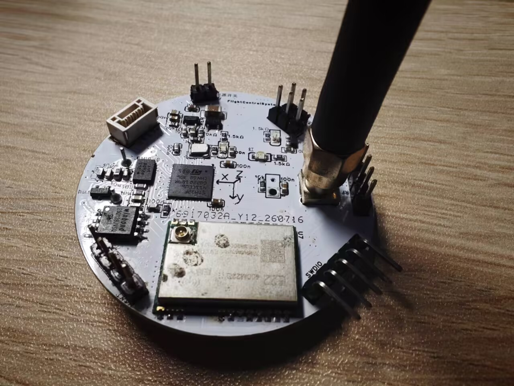
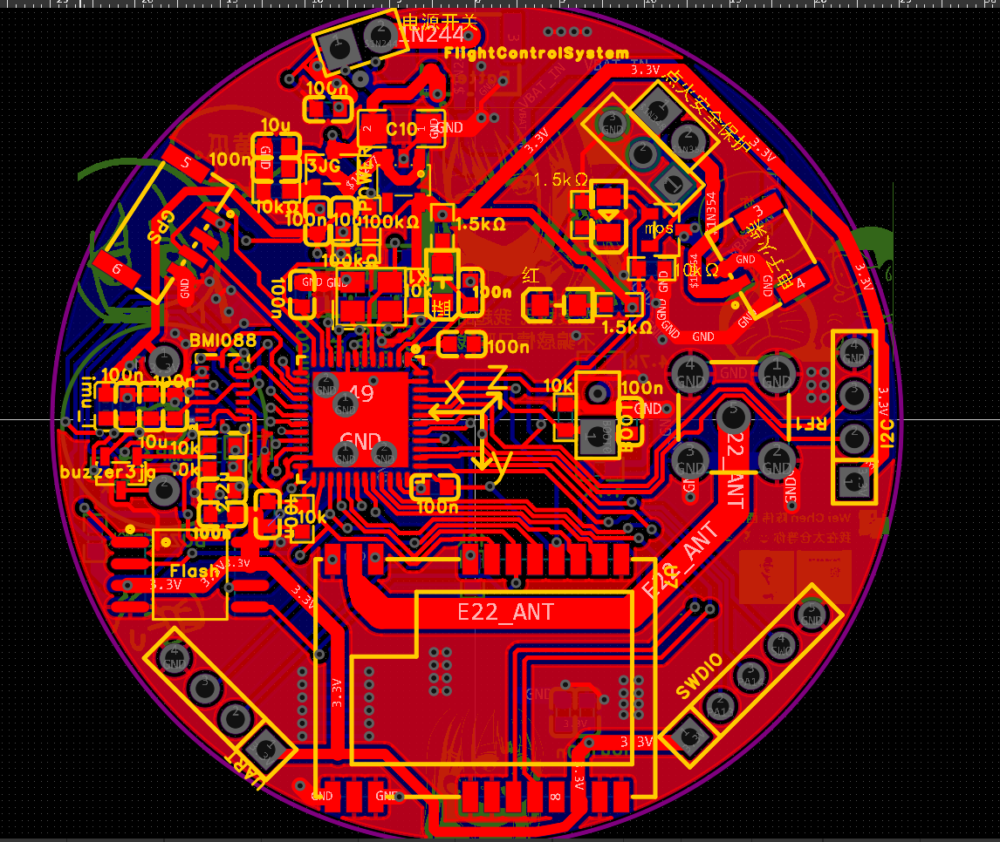

# V2版本航电

文档AI等级：2

<figure markdown>
  { height="300" }
  { height="300" }
</figure>

## 设计目标

- 上一代模块化飞控采用所有模块单独焊接到一个独立板子上的构造，这种构造非常浪费板内空间，所以这次版本航电采用最小电子元件集成式的焊接模式。
- 且上一代飞控的软件系统过于简陋，本次飞控软件系统建立全新的火箭标准库RSL，并且引入FreeRtos来进行任务调度，总体复杂度和可开发性上升一个量级。
- 支持实验火箭自主飞行数据采集
- 支持实时LoRa遥测
- 支持飞行状态判断
- 支持后续扩展视觉识别模块
- 提供长期维护的软件架构

## 版本信息

| 项目 | 内容 |
|-|-|
| 硬件版本 | V2.1 |
| 开始设计 | 2026-07 |
| 当前状态 | 软件集成阶段 |
| MCU | STM32F411 |
| RTOS | FreeRTOS |
| PCB状态 | 已完成 |
| 飞行状态 | 未进行实际飞行 |

## 基本介绍

本航电于2026年7月开始设计，基于STM32F411与FreeRTOS的实验火箭飞行控制系统，集成姿态解算、GNSS 定位、LoRa 遥测与飞行数据记录。

## 硬件介绍

| 模块 | 型号 | 用途 |
|-|-|-|
| MCU | STM32F411 | 主控制器 |
| IMU | BMI088 | 六轴惯性测量 |
| GNSS | NEO-M9N | 定位 |
| LoRa | SX1268 | 无线通信 |
| Flash | W25Q128 | 数据存储 |
| 气压计 | BMP388 | 高度测量 |

## 系统功能

### 姿态系统

- BMI088数据采集
- 四元数AHRS解算
- 姿态输出

### 通信系统

- SX1268驱动
- LoRa双向通信
- 遥测发送
- 地面站指令接收

### 数据系统

- Flash存储
- Logger框架
- 自描述数据格式

### 飞行控制

- 状态机
- 飞行阶段识别
- 开伞控制

## 当前进度

项目目前处于软件功能集成与系统联调阶段。

## 细节说明

### 软件设计说明

### Command Context 设计

在application层的命令系统中，在处理回调函数时，由于命令解析框架（RSL CommandEngine）中的回调函数由框架主动调用，其执行上下文不再处于原本的RocketCommand对象成员函数调用链中，因此需要通过context将Application层对象传递给回调函数在app_command->mid_command->回调函数这一整个链条里面，保留了一个“context”指针，app_handler文件里面的回调函数可以通过context来操作rocket类里面的其他对象的指针。

### Commander 设计

rocket类作为总类，其下包含若干个commander类指针，而每个commander类实例只能包含一个数据来源，比如UARTcommander，LORAcommander。

本航电拥有两个commander，UARTcommander和LoRacommander，而每个commander对应一个数据的来源，这个数据来源函数需要转移两个数据：一个是数据的Buffer指针，另一个是数据的长度，本版本航电中，UART数据采用的是系统中断回调，放在tsk_isr内，当UART收到一个包，HAL库会中断并自动调用uart1Callback这个函数，紧接着调用rocket类内的receiveUARTCommandData函数，receiveUARTCommandData函数的作用是在中断内把Buffer指针和数据长度的信息转移到rocket类内的私有变量，并且把标志位置为收到Data的状态，而住循环内的另一个函数handleUARTCommandData在检测到标志位后自动处理rocket类内私有变量（buffer）所存储的Data。这样设计是为了把“数据写入”和“数据解析”分开，避免中断内处理大量解析的操作，占用中断。

接着上文，而LoraCommander的数据来源来自于app层内Communication封装里面的communicatorLoop函数，这个函数会不断循环，承担两个作用：将rocket其他部分的发送请求所产生的队列内的待发送包发送出去，以及在不发送的时候将lora硬件置为Rx接收状态，当接收到数据时，在communicatorLoop的输入值内把标志位置1并返回buffer的指针。所以可以看到Lora的信息来自于RocketTask在调用communicatorLoop的自我循环，不需要中断，而Rocket类大可以直接在communicatorLoop后面直接判断是否收到消息并调用commander解析，但是处于两个考虑：1 为了让commander的格式尽可能相同。2以后communicatorLoop可能不在rocketLoop中循环而是加入中断等其他措施。所以communicatorLoop执行完的后面，同样延续了UartCommand的结构，先把communicatorLoop接收到的buffer转换到rocket类内自己的buffer里面，然后把自己的标志位置1，主循环内的handleLoraCommandData会自动去解析收到的一包数据。

## Debug记录

### 6 Aug 2026

写好气压计库后，在进行测试时发现无法与气压计进行通讯，经过排查后确认为气压计虚焊。

### 8 Aug 2026

写好LoRa库后，对LoRa进行第一次通信测试，在两个开发板上烧录一样的代码进行收发测试，发送板上出现发送失败的现象，报错误码为16号“TxTimeOut”。当时采用的发送模式为阻塞式发送，每次发送时，mcu首先会执行startTransmit()将本次发送信息传递给lora芯片，然后进入循环等待lora芯片的中断信号来指示是否发送成功，这个信号被体现为DIO1口的拉高电平。经过调试之后，确认问题确实是DIO1口没有被lora主动拉高所导致超过等待时间阈值，而报错16号TimeOut。

当时假定了两种原因：1lora芯片配置问题导致DIO1无法被拉高，比如TX无法成功执行，那么自然也没有后续的中断被触发；2DIO1与MCU的连接接触不良。首先，为了确定是否是MCU接触不良，在读取DIO1的电平时同时读取了LoRa芯片内的中断寄存器，如果lora中断寄存器有记载中断，和DIO1没有接收到中断相悖，那么就可以代表是MCU接触不良。但是，测试结果发现中断寄存器同样没有记载到中断，所以暂时推迟了对DIO1引脚虚接的判断，转向进一步排查软件问题。注意，此时为了调试将获取中断的方式从读取DIO1高电平改为了直接读取中断寄存器，但未更改回去，这并不是疏忽，但导致差点漏掉一个重要问题。

软件上，首先读取了startTransmit函数内部多个时间点的收到的SPI包内的status字节位，发现在经过setTX()后，status由原本正常的0x22变为了0x2A，对0x2A的解析结果为Command execution failed(命令已经收到，但执行失败)，而这将问题导向至了setTX在lora芯片内执行失败。但是status错误码只能指示执行失败这种简单的错误，无法给出更细节的原因，所以，在setTX后面执行getDeviceErrors()，读取lora芯片内的错误寄存器，读取结果为DeviceErrors = 0x0020 XOSC_START_ERR,也就是晶体振荡器 XOSC 启动失败。补充：SX1268采用的是内部RC振荡器+外部晶振的组合，在执行一些基础的配置和操作时(比如SPI通讯和寄存器配置)，会采用内部的RC振荡器，但是当进行需要准确时间操作的事情时，需要采用外部精准晶振，而外部晶振可以被配置为两种类型，第一种类型为XOSC(外部晶体振荡器)，也就是在lora芯片外部接一个无源振荡器，与内部XOSC电路形成谐振，这也是芯片初始化时会默认选择的模式。另一种类型为TCXO(温度补偿晶体振荡器)，这种振荡器同样也是外接，但与XOSC的区别为TCXO是有源晶振，只需要接一个频率输出口，但同时需要通过DIO3来给TCXO提供电压来支持其起振。对于E22-400M22S这个封装芯片，其只支持TCXO晶振。而在之前的代码移植过程中，漏掉了TCXO振荡器供电的配置，所以TCXO根本没有配置，lora芯片默认采用XOSC进行起振，自然会失败而报错XOSC_START_ERR。

所以重新对TCXO进行了配置，（小插曲：最新手册内SX1268的TCXO供电为2.2V，和radioLib内使用的1.6V不同，应该是radioLib内的疏忽）。再次进行测试，发现Command execution failed与XOSC_START_ERR已经消失，而且收发可以接收到零散的信号，但是信息是乱码，对发送时序重新进行审查，发现SPIwriteBuffer()函数内部没有在opcode字节后加offset位（用于接收status），所以会导致发送信息错位，解决方法是给SPIwriteBuffer()函数加了一个offset输入值，正常情况下offset为0就代表已经加装一个offset位。更改SPIwriteBuffer后再次测试，收发一切正常。不过当时重新思考，认为TCXO不会导致16号TxTimeOut，所以重新对DIO1口拉高电平检测中断进行排查。（但是其实TCXO确实也会导致16号TxTimeout，上面已经分析）。所以对DIO1引脚重新进行硬件排查，使用万用表对DIO1->MCU进行多次二分定位，最终确认MCU与DIO1焊盘的连接处存在虚焊，而lora焊盘连接则没有问题。而目前的解决方法是不再使用直接读取DIO1口电平的方式来获取中断，这在当前频率下并不会造成很大的时间占用，直到以后可能会对其硬件重新进行修理。

最终，主要问题可以被概括为三个：TCXO没有被设置，DIO1引脚虚焊，和没有添加offset的时序问题，而其中前两个问题在判断时叠加在了一起，导致出现排查上的困难。

同时，还有一些附加问题，拖延排查时间，1:lora循环的task的栈设置太小，导致栈溢出进入hardfort，调大栈后解决。2:呃我记不清了，刚才还想着来着，下次想到再添加吧

### 13 Aug 2026

被git做局了，在某次更改时，对原有文件进行了大批量更改，同时添加了几个临时新文件，但后续将新文件删除时，点delete手快直接把app_rocket.cpp也删除了，这导致此文件中没有被commit的更改也一样被删除了，git只能回溯到上一个版本。这件事告诉我们 1不要乱删东西，2要及时提交git,,,

## 硬件信息

- 原理图：[原理图.pdf](assets/hardware/原理图.pdf)
- PCB图：[PCB.pdf](assets/hardware/PCB图.pdf)
- BOM: [BOM](assets/hardware/BOM.xlsx)
- 交互式BOM：[iBOM](assets/hardware/iBOM.html)
- Gerber：[Gerber](assets/hardware/Gerber.zip)
- 3D模型：[3d模型](assets/hardware/3d模型.step)
- 贴片坐标：[坐标文件](assets/hardware/PickAndPlace.xlsx)
- 工程源文件：[源文件](assets/hardware/ProPrj_火箭飞行控制板初版_2026-07-07_12-04-26_2026-08-20.epro2)

## 软件源码

源码位置：[Rocket_FlightControlSystem](https://github.com/SophonSnwflake/Rocket_FlightControlSystem)