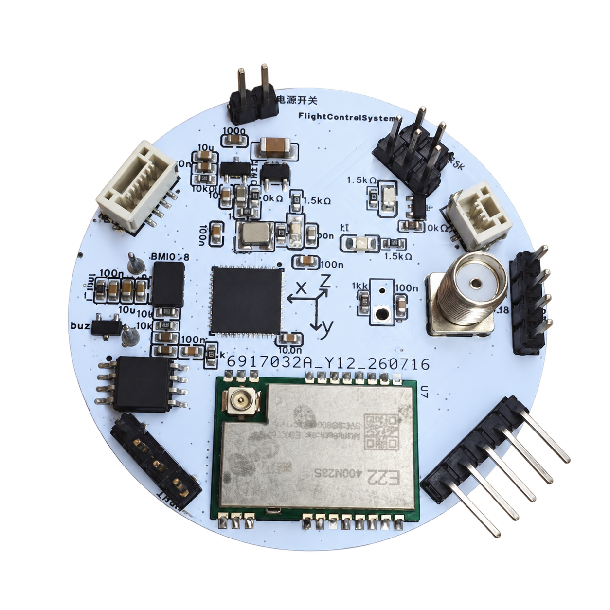

# V2版本航电

文档AI等级：2

<figure markdown>
  { height="300" }
  { height="300" }
</figure>

## 设计目标

- 上一代模块化飞控采用所有模块单独焊接到一个独立板子上的构造，这种构造非常浪费板内空间，所以这次版本航电采用最小电子元件集成式的焊接模式。
- 且上一代飞控的软件系统过于简陋，本次飞控软件系统建立全新的火箭标准库RSL，并且引入FreeRtos来进行任务调度，总体复杂度和可开发性上升一个量级。
- 支持实验火箭自主飞行数据采集
- 支持实时LoRa遥测
- 支持飞行状态判断
- 支持后续扩展视觉识别模块
- 提供长期维护的软件架构

## 版本信息

| 项目 | 内容 |
|-|-|
| 硬件版本 | V2.1 |
| 开始设计 | 2026-07 |
| 当前状态 | 软件集成阶段 |
| MCU | STM32F411 |
| RTOS | FreeRTOS |
| PCB状态 | 已完成 |
| 飞行状态 | 未进行实际飞行 |

## 基本介绍

本航电于2026年7月开始设计，基于STM32F411与FreeRTOS的实验火箭飞行控制系统，集成姿态解算、GNSS 定位、LoRa 遥测与飞行数据记录。

## 硬件介绍

| 模块 | 型号 | 用途 |
|-|-|-|
| MCU | STM32F411 | 主控制器 |
| IMU | BMI088 | 六轴惯性测量 |
| GNSS | NEO-M9N | 定位 |
| LoRa | SX1268 | 无线通信 |
| Flash | W25Q128 | 数据存储 |
| 气压计 | BMP388 | 高度测量 |

## 系统功能

### 姿态系统

- BMI088数据采集
- 四元数AHRS解算
- 姿态输出

### 通信系统

- SX1268驱动
- LoRa双向通信
- 遥测发送
- 地面站指令接收

### 数据系统

- Flash存储
- Logger框架
- 自描述数据格式

### 飞行控制

- 状态机
- 飞行阶段识别
- 开伞控制

## 当前进度

项目目前处于软件功能集成与系统联调阶段。

### 部分软件设计说明

[部分软件设计说明](softwareDesign/index.md)

## Debug记录 / 开发日志

[开发日志](log/index.md)

## 硬件信息

- 原理图：[原理图.pdf](assets/hardware/原理图.pdf)
- PCB图：[PCB.pdf](assets/hardware/PCB图.pdf)
- BOM: [BOM](assets/hardware/BOM.xlsx)
- 交互式BOM：[iBOM](assets/hardware/iBOM.html)
- Gerber：[Gerber](assets/hardware/Gerber.zip)
- 3D模型：[3d模型](assets/hardware/3d模型.step)
- 贴片坐标：[坐标文件](assets/hardware/PickAndPlace.xlsx)
- 工程源文件：[源文件](assets/hardware/ProPrj_火箭飞行控制板初版_2026-07-07_12-04-26_2026-08-20.epro2)

## 软件源码

源码位置：[Rocket_FlightControlSystem](https://github.com/SophonSnwflake/Rocket_FlightControlSystem)

## 参考文档/手册

- W25Q28芯片手册：[W25Q28.pdf](assets/papers/W25Q28.pdf)