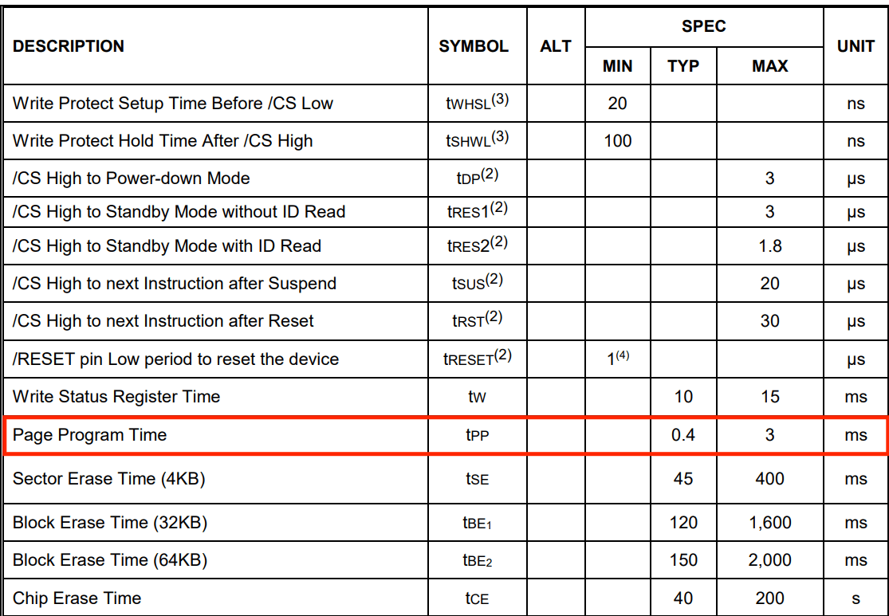
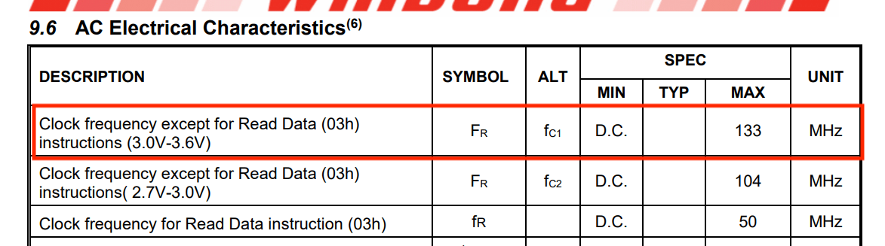

### 6 Aug 2026

写好气压计库后，在进行测试时发现无法与气压计进行通讯，经过排查后确认为气压计虚焊。

### 8 Aug 2026

写好LoRa库后，对LoRa进行第一次通信测试，在两个开发板上烧录一样的代码进行收发测试，发送板上出现发送失败的现象，报错误码为16号“TxTimeOut”。当时采用的发送模式为阻塞式发送，每次发送时，mcu首先会执行startTransmit()将本次发送信息传递给lora芯片，然后进入循环等待lora芯片的中断信号来指示是否发送成功，这个信号被体现为DIO1口的拉高电平。经过调试之后，确认问题确实是DIO1口没有被lora主动拉高所导致超过等待时间阈值，而报错16号TimeOut。

当时假定了两种原因：1lora芯片配置问题导致DIO1无法被拉高，比如TX无法成功执行，那么自然也没有后续的中断被触发；2DIO1与MCU的连接接触不良。首先，为了确定是否是MCU接触不良，在读取DIO1的电平时同时读取了LoRa芯片内的中断寄存器，如果lora中断寄存器有记载中断，和DIO1没有接收到中断相悖，那么就可以代表是MCU接触不良。但是，测试结果发现中断寄存器同样没有记载到中断，所以暂时推迟了对DIO1引脚虚接的判断，转向进一步排查软件问题。注意，此时为了调试将获取中断的方式从读取DIO1高电平改为了直接读取中断寄存器，但未更改回去，这并不是疏忽，但导致差点漏掉一个重要问题。

软件上，首先读取了startTransmit函数内部多个时间点的收到的SPI包内的status字节位，发现在经过setTX()后，status由原本正常的0x22变为了0x2A，对0x2A的解析结果为Command execution failed(命令已经收到，但执行失败)，而这将问题导向至了setTX在lora芯片内执行失败。但是status错误码只能指示执行失败这种简单的错误，无法给出更细节的原因，所以，在setTX后面执行getDeviceErrors()，读取lora芯片内的错误寄存器，读取结果为DeviceErrors = 0x0020 XOSC_START_ERR,也就是晶体振荡器 XOSC 启动失败。补充：SX1268采用的是内部RC振荡器+外部晶振的组合，在执行一些基础的配置和操作时(比如SPI通讯和寄存器配置)，会采用内部的RC振荡器，但是当进行需要准确时间操作的事情时，需要采用外部精准晶振，而外部晶振可以被配置为两种类型，第一种类型为XOSC(外部晶体振荡器)，也就是在lora芯片外部接一个无源振荡器，与内部XOSC电路形成谐振，这也是芯片初始化时会默认选择的模式。另一种类型为TCXO(温度补偿晶体振荡器)，这种振荡器同样也是外接，但与XOSC的区别为TCXO是有源晶振，只需要接一个频率输出口，但同时需要通过DIO3来给TCXO提供电压来支持其起振。对于E22-400M22S这个封装芯片，其只支持TCXO晶振。而在之前的代码移植过程中，漏掉了TCXO振荡器供电的配置，所以TCXO根本没有配置，lora芯片默认采用XOSC进行起振，自然会失败而报错XOSC_START_ERR。

所以重新对TCXO进行了配置，（小插曲：最新手册内SX1268的TCXO供电为2.2V，和radioLib内使用的1.6V不同，应该是radioLib内的疏忽）。再次进行测试，发现Command execution failed与XOSC_START_ERR已经消失，而且收发可以接收到零散的信号，但是信息是乱码，对发送时序重新进行审查，发现SPIwriteBuffer()函数内部没有在opcode字节后加offset位（用于接收status），所以会导致发送信息错位，解决方法是给SPIwriteBuffer()函数加了一个offset输入值，正常情况下offset为0就代表已经加装一个offset位。更改SPIwriteBuffer后再次测试，收发一切正常。不过当时重新思考，认为TCXO不会导致16号TxTimeOut，所以重新对DIO1口拉高电平检测中断进行排查。（但是其实TCXO确实也会导致16号TxTimeout，上面已经分析）。所以对DIO1引脚重新进行硬件排查，使用万用表对DIO1->MCU进行多次二分定位，最终确认MCU与DIO1焊盘的连接处存在虚焊，而lora焊盘连接则没有问题。而目前的解决方法是不再使用直接读取DIO1口电平的方式来获取中断，这在当前频率下并不会造成很大的时间占用，直到以后可能会对其硬件重新进行修理。

最终，主要问题可以被概括为三个：TCXO没有被设置，DIO1引脚虚焊，和没有添加offset的时序问题，而其中前两个问题在判断时叠加在了一起，导致出现排查上的困难。
s
同时，还有一些附加问题，拖延排查时间，1:lora循环的task的栈设置太小，导致栈溢出进入hardfort，调大栈后解决。2:呃我记不清了，刚才还想着来着，下次想到再添加吧

### 13 Aug 2026

被git做局了，在某次更改时，对原有文件进行了大批量更改，同时添加了几个临时新文件，但后续将新文件删除时，点delete手快直接把app_rocket.cpp也删除了，这导致此文件中没有被commit的更改也一样被删除了，git只能回溯到上一个版本。这件事告诉我们 1不要乱删东西，2要及时提交git,,,

### 8 Sep 2026

在对lora进行地面站和飞控的互相通讯测试时，发现飞控无法收到地面站的消息，在排查时把飞控的TX逻辑注释掉后，则可以正常收到数据，由此证明问题在于TX在循环中占用了太多时间，导致RX几乎没有可以收到消息的空余。

### 14 Sep 2026

在调试的时候希望看到IMU的Z轴数据，在selectPhase函数里面打印，发现打印出的数字一直是同一个值，开机时为0，切换Phase后为一个固定值，但是在IMUloop里面打印则可以正确刷新。认为原因为包含selectPhase的RocketLoop的循环频率为1000hz，而IMUloop的循环频率同样为1000hz，所以如果RocketLoop里面包含printf的高耗时函数时，会导致IMUloop得不到分配，经测试，将rocket循环频率降至100hz后，即使内部有printf函数，也不会导致IMUloop被架空。考虑到RocketLoop内不做特别多对时间要求紧张的操作，所以保留RocketLoop为100hz。

### 17 Sep 2026

使用vofa调试器将ahrs解析后的欧拉角进行可视化，确认欧拉角顺序为：Roll-Pitch-Yaw.但是轴的朝向和普遍意义上认为的火箭的朝向不一样，航电板的y轴指向飞机机头方向，z轴正方向代表垂直尾翼。为了方便Pitch轴角度用于判断开伞，所以在IMU装配矩阵上进行更改，通过旋转矩阵使得IMU。而测试时其其实已经有了一个旋转矩阵，这个旋转矩阵是纠正开发板绕Z轴逆时针安装90°误差。也就是绕 \(+Z\) 轴旋转 \(+\frac{\pi}{2}=+90^\circ\)。原来的矩阵为：

$$
R_z\left(\frac{\pi}{2}\right)
=
\begin{bmatrix}
0 & -1 & 0 \\
1 & 0 & 0 \\
0 & 0 & 1
\end{bmatrix}
$$

所以说，除去这个已经有的旋转矩阵，那么真实的坐标系标定为：x轴正方向为机头方向，z轴正方向为垂直尾翼方向。

而为了使得Pitch能够指向火箭箭头所指的方向，所以首先，去除原来的旋转矩阵，从x轴为机头方向的基础上重新构造旋转矩阵：从y轴的箭头朝原点看去，要求我们实际的模型相对装配顺时针旋转90度，也就是说装配相对与真实的飞机是从y轴的箭头朝原点看去逆时针转了90度。

$$
R_y\left(-\frac{\pi}{2}\right)
=
\begin{bmatrix}
0 & 0 & -1 \\
0 & 1 & 0 \\
1 & 0 & 0
\end{bmatrix}
$$

实验结果良好。

### 18 Sep 2026

添加电压探针驱动，在测试时发现电压读取数据为0.0V，原始数据为1，对硬件进行排查时中间的一个分压电阻出现一端虚焊，导致电压传不到MCU，试图使用热风枪融化锡焊，但因无助焊剂导致焊盘氧化且难以操作。遂放弃，等待工具到齐与工作台搭建完毕后再测试电压探针。GPS同样需要等烙铁到货后焊接接口。目前只能先完善软件鲁棒性，今天目标是排查火箭发射全流程的遥测逻辑。

### 18 Sep 2026

之前的设计是：四种数据（Flight，GNSS，System，Raw）均被不同的send函数压入同一个缓冲区队列内，缓冲区队列存在数十个缓冲位置，但是考虑到LoRa发送的特殊性，LoRa发送的速度极慢，目前的参数下，典型发送周期为290ms，实测发送时间可达300ms以上，此数量级已经达到了发送速率的数量级。所以当多个数据同时涌入缓冲区时，会造成数据积压，导致后面的数据永远慢一个相位。为了改善这一状况，取消缓冲区机制，让调度器始终发送最新的数据。所以对原先的缓冲区进行如下操作：1将单个大缓冲区以发送内容为分类，将其拆解成多个小型缓冲区 2每个缓冲区的元素数量为1。并且修改遥测循环，使得每次循环里面遍历四种数据缓冲区，如果内有新数据则发送，没有新数据则跳过。其余内容例如RXTX比例管理未改动。

### 19 Sep 2026

面包板上的地面端的主控模块突然无法烧录，也无法正常运行，更换开发板后问题消失。暂未定位问题成因。

### 20 Sep 2026

对logger系统的写入速率进行计算。计算结果为：

| 消息类型 | 单个大小(Byte)   | 写入频率(Hz)          | 最终速率(Byte)                      |
| -- | ---- | ----------- | ----------------------- |
| IMU | 29 | 1000| 29KHz |
| AHRS | 45 | 1000 | 45KHz |
| GNSS | 61 | 5 | 0.3KHz |
| FlightState | 21 | 5 | 0.1KHz |
| Power | 21 | 5 | 0.1KHz |
| SystemHealth | 74 | 2 | 0.074KHz |

所需要的带宽总量为：

29 + 45 + 0.3 + 0.1 + 0.1 + 0.074 = 74.6KHz

<figure markdown>
  { height="300" }
</figure>

计算W25Q128芯片能提供的最大硬件写入速度，W25Q128单个Page的典型写入时长为0.4ms，最大写入时长为85KHz，也就是最小带宽为：

$$
v=\frac{256}{3\,\text{ms}}\times1000
\approx 85\,333\ \text{Byte/s}
\approx 85.3\ \text{kB/s}
$$

83.5 > 74.6KHz（Byte）,证明硬件不是瓶颈。

计算当前W25Q128的SPI速率：

$$
v_{\text{SPI}}
=
\frac{50\,\text{MHz}}{128}
\times
\frac{1}{8}
=
390.625\,\text{kHz}
\times
\frac{1}{8}
=
48.828125\,\text{kB/s}
$$

48.8KHz < 74.6，证明当前SPI速率远达不到Flash芯片所需要的频率。

计算W25Q128最大写入可承受的SPI速率

<figure markdown>
  { height="200" }
</figure>

$$
v_{\text{SPI,max}}
=
\frac{133\,\text{MHz}}{8}
=
16.625\,\text{MB/s}
$$

而当前SPI2能提供的最大SPI速率为分频系数设为2时：

$$
v_{\text{SPI}}
=
\frac{50\,\text{MHz}}{2}
\times
\frac{1}{8}
=
3.125\,\text{MB/s}
$$

很明显，W25Q128不会承受不了最大的SP1速率。

所以，在改进方案中，将分频系数由128更改为2。

改进后的SPI通信速率与硬件速率均不会限制住写入所需的带宽。

### 20 Sep 2026

发现GNSS的丝印和实际线序不一样，GPSMODULE_RX实际对应STM32的PA3，也就是STM32的RX，所以实际接收线序应该是PA3->GPSMODULE_RX->实际芯片的TX。而PA2也是一样。

