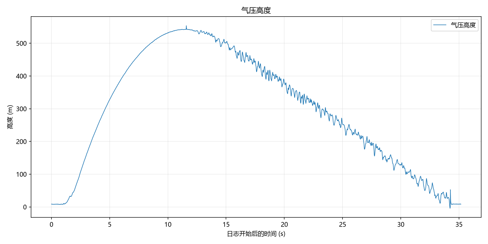
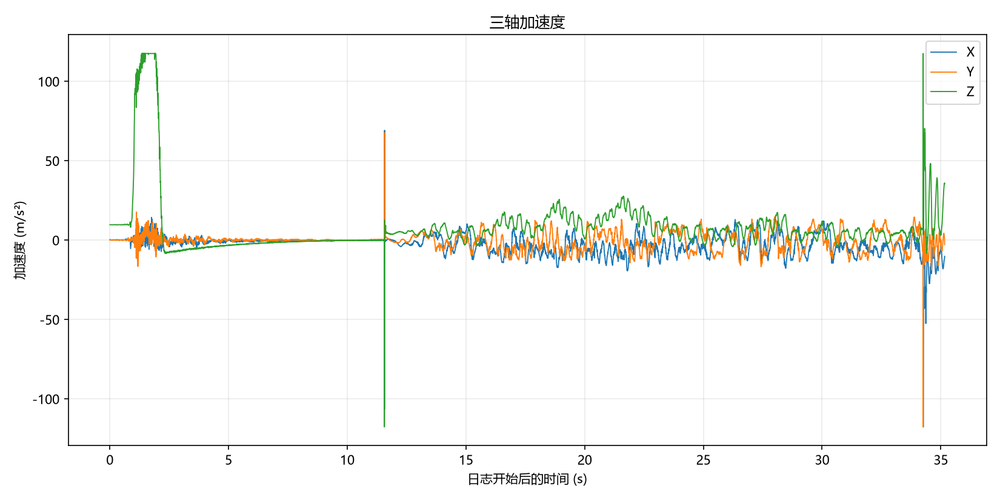
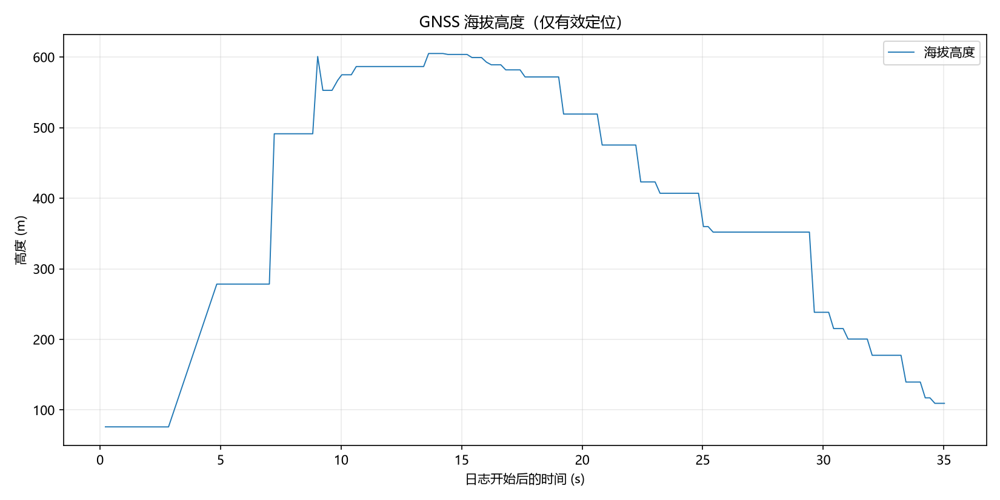
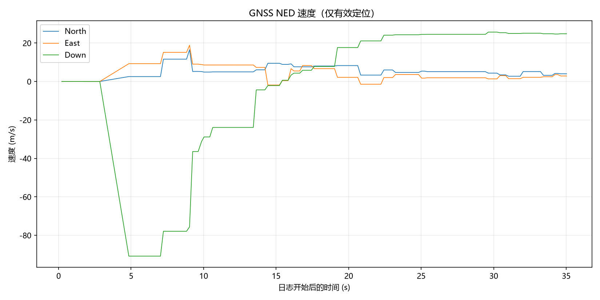

# Oct_3_2026

- 发射流程手册：[发射流程手册.docs](assets/发射流程手册.docx)
- 航电操作手册：[操作手册V2.0.docs](assets/操作手册%20V2.0.docx)

---

## 发射概述

发射日期预计2026年10月3日，地点河南省 登封县郊区。本次发射使用V2.0版本航电。由于本次发射是第一次发射，为了方便寻找火箭落点以及减少可能的法律风险，本次目标高度定为300米，300米是6cm箭体直径在天空中人眼的理论观测距离最大值。

---

## 人员

共计三人 小叮当 白 某科学的超级屑

---

### 发射日志

#### Sep 30 2026

小叮当上午10点到达封丘县迅捷商务宾馆，与白在酒店会面，计划在1-2号期间进行两次试车，第一次试车验证比冲，第二次浇筑时，按照300m预计高度以及对应比冲，通过OR反算出实际总冲和对应燃料孔径，浇筑完后第二次试车验证可行性。确认无问题后第三次浇筑火箭实际使用药柱。下午白回家进行第一次浇筑，小叮当去试验新无人机，并改写试车台相关代码，要求本次试车台能够可靠地输出准确推力和时间戳。预计明天早上9.30在封丘县南与耕地交界处进行第一次试车。

---

#### Oct 1 2026

小叮当与白在早上10点左右到达封丘县南边的一个土工地进行发动机试车，固定好试车台和发动机后，尝试对试车台进行初始化并模拟试车操作。接连出现两个问题：SD卡无法被成功读取，或SD卡在测试中断联，以及HX711模块断联。经过排查后，确认都是硬件问题，接触不良或者SD卡松。虽然硬件存在很强的不可靠问题，但为了试车的推进，在某次进入正常读取后，进行了点火试车。发动机点火正常，火焰因为后方压试车台的砖头而转向，令试车台的最下方铝型材小部分熔化，发动机工作后，被喷出位置存在非常多白色固体残留，喷口处覆盖了一层厚度约0.5-1mm的白黄色固体残留，猜测是内部的塑料燃料壳体被熔化。查看记录数据，发现在读取时，只读到了推力最大点后几个样本后断联，串口显示断连原因为SD卡连接失效。推测原因为最大推力时的振动导致SD卡接触不良。提出解决措施：对于HX711和SD卡，尽可能将其连接固定牢固。对于SD卡失效就停止采集的逻辑，更改软件逻辑，使其不管在SD卡是否正常的请款下都会同时通过串口发送数据，多一层保障。

通过对残缺的推力数据进行分析，原始数据不加后续拟合的话，总冲为142.67Ns，比冲61.91s，通过线性拟合的方式补全剩余的一些数据后，计算总冲为158.2Ns,比冲为68.84。比冲明显偏低。KNSB理论比冲为164，论坛普遍测试参数为90-120，小叮当在24年10月份的金属30mm发动机的实测比冲为98，推测本次比冲偏低的原因有两个：1KNSB内的硝酸钾虽有研磨，但未过200目筛，2燃料在制作过程中烘干不足，可能存在吸水现象。但由于本次火箭的目标高度300米的总冲需要远低于此发动机的最大总冲（将线性补全后的数据代入进OR计算得到理论高度为463米。所以比冲低并不会造成性能不够的影响。

下午2：30左右，携带飞控仓，地面站，前去新乡县南部的一个公园进行飞控完整性测试，第一个测试的是拉距测试，将飞控带电池固定于无人机上，启动无人机升高至100米，地面站首先采用的是测试用的短棒天线，随着无人机不断拉远，遥测信息在100米高，700米远的位置失联。随后换至实际发射时采用的11DBi，6单元八木天线进行测试，距离明显提升，无人机飞向高度100米，距离1000米的位置，仍然能保持有效连接。没有进行极限通讯测试，在测试过1000米的距离后返航。随后进行完整火箭周期的飞控测试，首先打开飞控，自带STANDBY状态，擦除全片，进入ARMED状态，用手模拟剧烈Z轴加速度后观察，10秒后电子火柴成功启动点火，随后10秒钟后自动进入LANDED模式并发出节奏性蜂鸣器响声。最后，进行了GPS精准度测试，由白手持飞控沿着公园小路进行行进，地面站观察经纬度信息并上传QGIS离线地图，手动复制粘贴采样大约10个点，发现位置精准度较好，能够指示火箭方位。但是，本次试验没有进行Flash的读取试验。回到酒店，对python地面站进行更改，使其能够通过虚拟串口将飞控GNSS信息时时传到QGIS，这样就不需要手动进行来回复制了。

- Oct_1_2026 试车视频：[Oct_1_2026 试车视频](assets/Oct1_2026试车视频_无人机.mp4)

本次试车采用15mm内径，10-2日下一次试车采用22mm内径，22mm内径的选择是基于300m目标高度在Openrocket内得出的比冲反算结果。

- Oct_1_2026 试车原始数据（无补全）：[Oct_1_2026 试车原始数据（无补全）](assets/Oct12026试车原始数据（无补全）.CSV)

---

#### Oct 2 2026

效仿前一天，白于早上十点左右到达酒店，组装试车台并且测试，发现新代码仍然存在当SD卡掉线后堵住全部循环的现象，于是便不断更改试车台代码，发现AI生成的试车台arduino驱动代码过于复杂且在第二次更改时也没有让SD卡堵住进程的问题解决，于是手动调整代码使其在SD卡第一次写入失败后置标志位为false，而后跳过SD卡写入，只串口记录，这版代码测试无问题，但在有一次测试中，SD卡又出现断联的现象且无法恢复，这代表SD卡模块的硬件极其不稳定，索性删除SD卡模块的所有驱动代码，仅使用串口输出用于记录。

中午十二点左右到达试车地点，组装试车台和发动机，准备试车，无人机升空开始录制，但后来发现没有录制上。发动机工作良好，数据被串口监测器成功记录。

本次试车记录到了完整的推力数据，但是由于发动机被数个固定环固定，所以由于这个环可能导致了发动机在往前推进时卡住，然后无法回弹，造成了正常推力曲线的基础上后面出现了一个小的数据保持的平台。经过讨论这个平台并非发动机实测数据，所以通过将发动机推力衰减段进行线性拟合的方式去掉了这一段错误数据。

- Oct_1_2026 推力数据：[Oct_2_2026 推力数据 22mm](assets/Oct_2推力数据_22mm.xlsx)

屑于下午5点到达酒店并住宿。

---

#### Oct 3 2026

上午10点左右，白到达酒店，开始总体总装。在总装过程中，出现了一些装配上的不便利，以及发现了一系列设计上的问题。火箭在中午12.30左右完成总装，在1.30装车，开往发射场。

发射场选在新乡南部的黄河滩地耕地上，其面积大于1*1km公顷，大于OR模拟出的在6m/s风速下的最大漂移距离500m。

在发射场，各人员按照预定计划进行部署，按照发射流程手册。架设发射架->飞控上电->测试飞控通信->测试GNSS信息有效性->安装点火系统 逐一通过。

下午4.40左右，风向西南风，天气阴。所有人员撤离发射点，白在观察点点击远程点火按钮无反应，推测为点火器距离太远断联。等待一分钟后，走近约10-20米重新点击按钮，成功点火，火箭在下午10.43分点火并发射升空。发动机工作正常，箭体轨迹近乎笔直，火箭在升空约1秒后尾迹消失，消失于视野，肉眼无法追踪。

小叮当在车内观察地面站遥测信号，遥测系统信号优良，观测到气压计高度以既定遥测刷新率不断变化，从地面逐渐升至300米-400米-500米-540米，在大概540米的高度下，火箭状态从ASCENT转换为DESCENT，近乎同一时间，天空中传来一声明显的闷响，这代表开伞成功，或者说开伞信号在预定的位置成功触发并点燃开伞药。转到QGIS页面，可以看到火箭坐标点正在以能观察到的连续性和速度从发射点朝向东北方向移动。随后，高度信息开始迅速降低，而遥测状态在大约10秒后从RECEIVING变成LOST，代表遥测失联，而最后的遥测包显示高度信息为8m。结合遥测信息在地面附近失联与遥测在开伞后短时间内失联，小叮当认为是降落伞没有打开，可能是伞包卡住，导致火箭自由落体下坠到地面使得飞控断联。

观察QGIS内的最后坐标，发现其最后坐标在发射点东北方向约200-300米区域，于是启动无人机向发射点东北方向寻找。同时在场人员(白，屑以及白和小叮当的家人)共计9人开始集体向东北方向寻找。本次寻找高估了无人机的作用，无人机在升空后由于操作屏幕较小，且阳光较为强烈，无法看清屏幕细节，无人机寻找无结果。但是人员寻找陆续有了结果，首先是找到一节伞仓，伞仓已经断裂，而降落伞在内部并未展开，头锥还卡在伞仓上部并未弹出，推测原因是在开伞药点火后，并未按照预想的流程将头锥和降落伞抛出，而是伞仓的中部区域无法承受压力而在z轴裂开并断裂。随后捷报频传，找到了航电舱和一些伞仓碎片，航电舱基本保存完好，PCB板没有受损，外壳除了与发动机仓和伞仓的连接处折断外，其余无明显受损。电池的从航点板上脱落，电池无受损，推测是在高速硬着陆时电池被冲击力甩开，挣脱了两个扎带的束缚并扯掉了电源线，导致整板断电，遥测失联。到此时，航电舱和伞仓残害均找回，剩余发动机舱未找到，在继续寻找约半小时后无结果，遂放弃。

在回收了现场的发射架和工具后，将所有物品装车并撤离，返回酒店进行一些数据处理操作。飞控的飞行日志信息从flash内成功被读取，可视化图表显示火箭日志完整的经历了火箭的上升段和下降段，各传感器和系统运行中共计零个错误。

气压计高度记录最高离地高度为553.62米，GNSS高度最大604.989米（海拔），GNSS记录最大垂直速度为90.832米。Logger原始信息将储存至avionics板块。

小叮当注：航电模块贡献与对外使用说明

本独立航电系统由我个人负责设计与开发，未接受团队资金资助。参与团队项目不代表本系统及其相关成果可直接以“穹宇航天”名义对外发布。

未经我事先同意，请勿将本系统的相关数据、图表、仿真结果及软硬件资料用于个人或团队的对外展示、宣传或其他创作。经同意使用时，应明确注明成果来源及我的实际贡献，不得通过省略署名或误导性表述，使他人误认为该成果由发布者独立完成。

以下是一些飞控记录的关键信息的图表化展示，如需下载全部请至飞控板块下载。

<figure markdown>
  { height="300" }
</figure>

<figure markdown>
  { height="300" }
</figure>

<figure markdown>
  { height="300" }
</figure>

<figure markdown>
  { height="300" }
</figure>