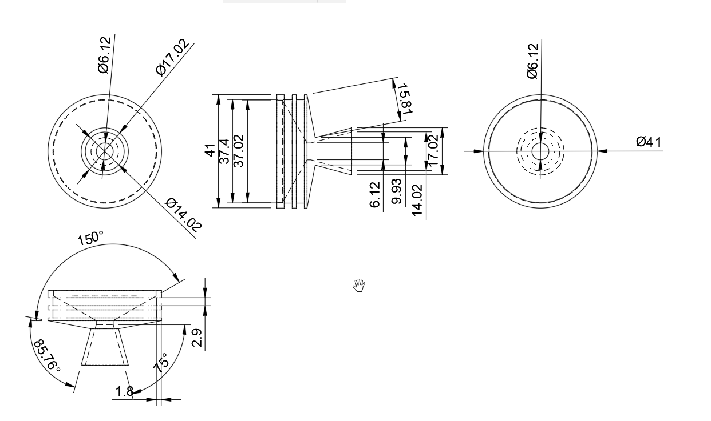
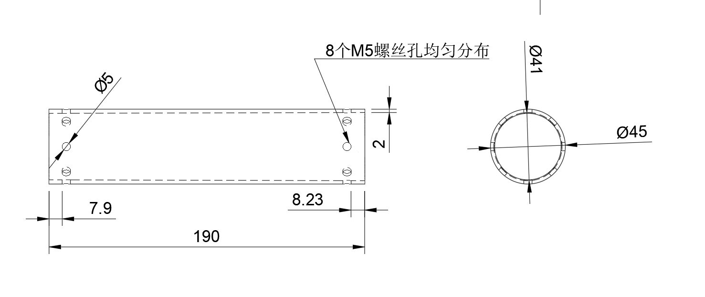
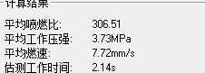
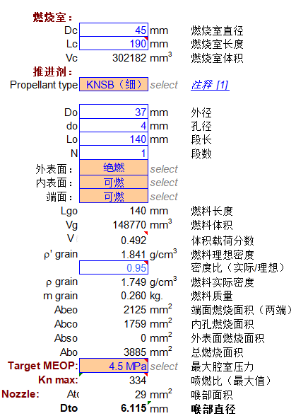
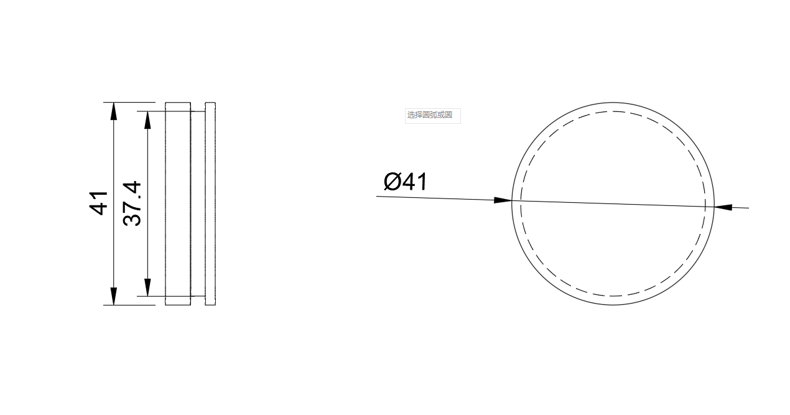
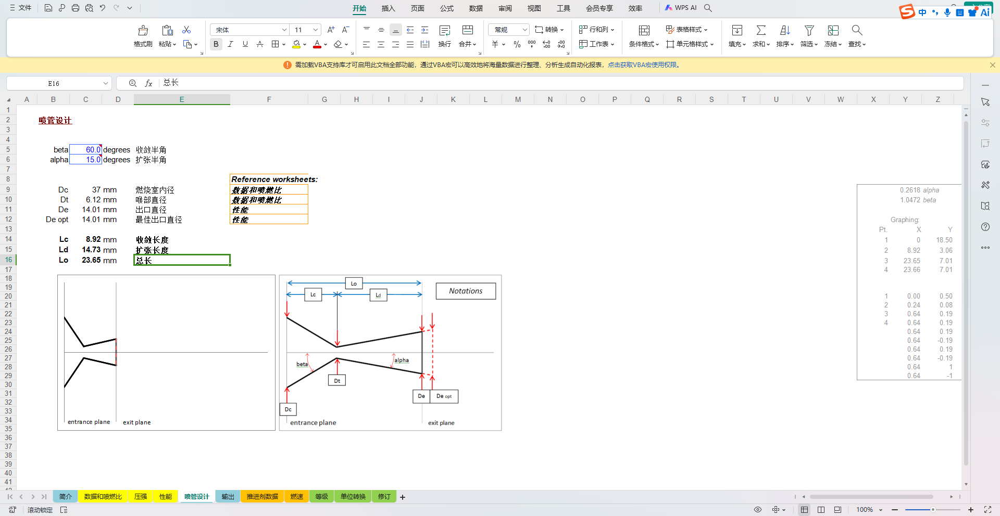

# V2代发动机

文档AI等级：4

<figure markdown>
  { height="300" }
  { height="300" }
</figure>

## 基本介绍

V2代发动机为固体推进剂实验火箭发动机，于 2026-07 开始设计。本页记录该发动机的结构组成、设计参数、部件三维模型以及设计过程中产生的工程图纸与仿真数据。

## 版本信息

| 项目 | 内容 |
|-|-|
| 发动机代号 | V2 代 |
| 推进剂类型 | KNSB（硝酸钾-山梨醇） |
| 燃烧室尺寸 | 直径 45 mm，长度 190 mm |
| 目标工作压强 | 4.5 MPa |
| 设计喷燃比 | 334 |
| 开始设计 | 2026-07 |

## 设计参数

固体推进剂设计与内弹道计算结果如下：

| 参数 | 数值 |
|-|-|
| 平均喷燃比 | 306.51 |
| 平均工作压强 | 3.73 MPa |
| 平均燃速 | 7.72 mm/s |
| 估测工作时间 | 2.14 s |
| 药柱直径 | 1.4567 in |
| 药柱长度 | 5.5118 in |
| 药柱中孔直径 | 0.1575 in |

## 喷嘴参数

| 参数 | 数值 |
|-|-|
| 喉部直径 | 6.12 mm（喉部面积 29 mm²） |
| 出口直径 | 14.01 mm |
| 收敛段长度 | 8.92 mm |
| 扩张段长度 | 14.73 mm |
| 收敛半角 | 60 deg |
| 扩张半角 | 15 deg |
| 膨胀比 | 5.252 |

## 部件 3D 模型

以下为发动机各部件的三维模型文件（STEP 格式），点击文件名即可下载：

| 部件 | 模型文件 |
|------|----------|
| 堵头 | [堵头.step](assets/model/堵头.step) |
| 喷口 | [喷口.step](assets/model/喷口.step) |

## 设计图纸与数据

以下为发动机设计过程中的工程图纸与计算数据截图：

| 内容 | 图片 |
|------|------|
| 药柱几何设计 | { height="200" } |
| 内弹道计算结果 | { height="200" } |
| 设计参数表 | { height="200" } |
| 固体药柱组件图纸 | { height="200" } |
| 燃烧室端盖图纸 | { height="200" } |
| 燃烧室装配图 | { height="200" } |
| 喷嘴计算表 | { height="200" } |
| 仿真系统设置 | { height="200" } |
| 仿真系统设置 | { height="200" } |
| 药柱几何输入检查 | { height="200" } |
| 喷嘴参数设置 | { height="200" } |

## 试车记录

以下为发动机静态试车过程中的视频记录，点击文件名即可查看或下载：

| 试车批次 | 视频文件 |
|----------|----------|
| 试车 1 | [motor_test_1_video_1.mp4](assets/video/motor_test_1/motor_test_1_video_1.mp4) |
| 试车 1 | [motor_test_1_video_2.mp4](assets/video/motor_test_1/motor_test_1_video_2.mp4) |
| 试车 2 | [motor_test_2_video_1.mp4](assets/video/motor_test_2/motor_test_2_video_1.mp4) |
| 试车 2 | [motor_test_2_video_2.mp4](assets/video/motor_test_2/motor_test_2_video_2.mp4) |

## 说明

* 模型采用 STEP 格式（ISO 10303），适用于主流三维 CAD 软件（如 SolidWorks、Fusion 360、FreeCAD 等）。
* 本发动机仍处于设计阶段，参数与模型将随设计迭代持续更新。
