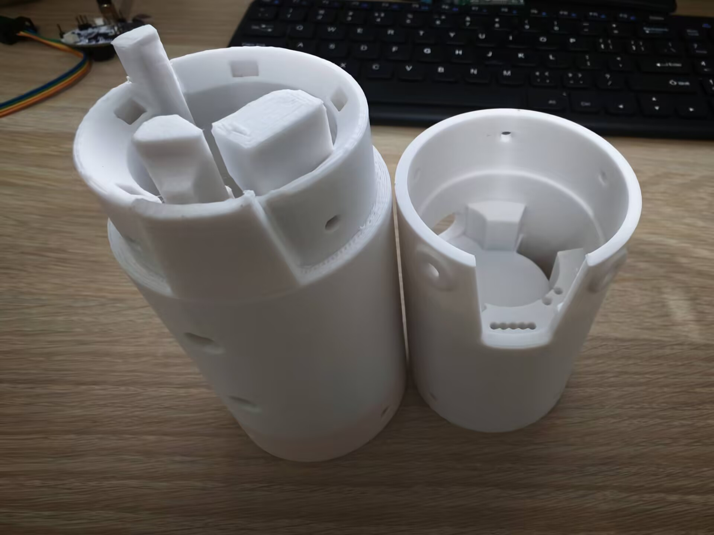

# V2版本航电仓

<figure markdown>
  { height="300" }
</figure>

文档AI等级：0

## 介绍

本航电仓是26年8月份为了适配V2版航电所设计的，内部包含了航电仓装配体，各个模型零件，外部参考零件和3D打印输出文件这三个文件夹。

舱室总体结构分为上部GPS舱段和下部PCB电池舱段，PCB刚性的被夹在两者之间，两个舱段采用M3螺丝连接，而和外部舱段采用M4螺丝连接。

使用solidworks2025建模，使用PETG作为打印材料

---

## Notes

- 目前为了适配其他舱段的连接件，采用了非常薄的连接壁而且连接处只有四个M4螺丝固定，刚性存疑，需要重新评估其可靠性
- PCB通过公差配合的方式强行被夹在两个舱段之间，硬性连接，会导致PCB直接收到火箭箭体发射时的强振动，且硬性挤压可能会对PCB板产生伤害。

---

## 接口声明以及连接件规范化

与外部舱段的连接螺丝典型规格：M4 * 12mm
内部两个舱段连接螺丝典型规格：M3 * 10mm
扎带典型规格：

| 类型 | 典型规格   | 备注          |
| -------- | ---- | ----------- |
| 与外部舱段的连接螺丝 | M4 * 12mm |无 |
| 内部两个舱段连接螺丝 | M3 * 10mm | 无 |
| 扎带 | 4 * 200mm | 无 |

---

## 3D文件

[下载3D文件压缩包](assets/电控舱.zip)