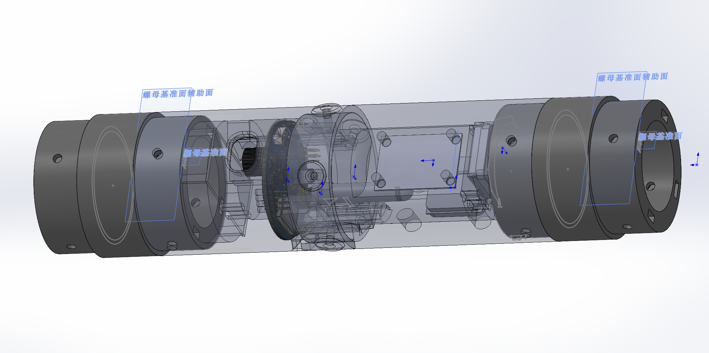

<figure markdown>
  { height="300" }
</figure>

# 结构系统
文档AI等级：4

结构系统负责火箭整体机械承载、外形保持、各子系统安装以及飞行过程中载荷的传递，是火箭各功能系统能够可靠工作的物理基础。

本板块用于记录火箭结构系统的设计方案、尺寸参数、CAD 模型、制造方法、装配流程、结构测试以及相关工程文件。

结构设计文档不仅应记录“零件是什么样”，还应尽可能记录其设计目的、设计约束、版本变化以及实际制造和装配过程中遇到的问题。

---

## 系统组成

火箭结构系统主要包括以下部分：

* 箭体与舱段结构
* 鼻锥
* 尾翼
* 航电舱
* 回收舱
* 发动机安装结构
* 舱段连接结构
* 内部设备固定结构
* 各类紧固件与安装接口

不同结构之间共同构成完整火箭的机械主体。

---

## **结构板块**

### 箭体结构

记录火箭主体外壳、舱段、连接结构以及整体机械布局。

[进入箭体结构文档](airframe/index.md)

### 航电舱

记录飞控板、电池、GNSS、通信设备以及其他航电设备的安装结构。

主要包含：

* PCB 固定
* 电池固定
* 舱内布局
* 连接件
* 线缆空间
* 维护方式

[进入航电舱文档](avionics_bay/index.md)

### 回收舱

记录降落伞、伞绳、部署机构以及相关结构设计。

[进入回收舱文档](recovery-bay/index.md)
